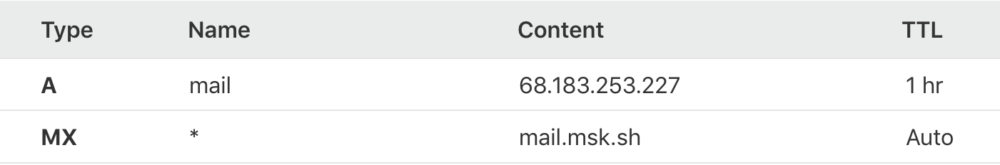

# Self-hosting guide

So you've decided to self-host [Mailmask](https://msk.sh)? That's great! This guide will get you up and running.

I'm going to assume you have experience using the terminal/commandline as well as setting up databases.

_Note: These instructions are written for Mac and/or Linux. If you're hosting on a Windows server you may have to replace some of the commands with the Windows equivalent._

## Pre-requisites

* [Node.js 12](https://nodejs.org/en/) or later installed and available in `PATH`
* [Yarn](https://yarnpkg.com/) package manager
* [PostgreSQL 9.6](https://www.postgresql.org/) or later, with [SSL support](https://www.postgresql.org/docs/9.1/libpq-ssl.html) ENABLED.
  * _I recommend [Digital Ocean](https://m.do.co/c/98d0e3d7eb67)'s cloud instances_

The following instructions are assuming you are running as the `root` user on your servers for the sake of brevity. Of course, you should
ideally create a new user and restrict the permissions, etc.

Additionally, I will assume that you will be hosting the mail server (MTA) and website on the same server machine.

I will also assume that your chosen domain name is `yourdomain.com`.

## Setup domain name

Register a domain name to use. _(I recommend [Namecheap](https://namecheap.com) for domains)_.

Setup email for your domain, using any email provider you like.

_Note: For the remainder of this guide I am going to assume your domain is `yourdomain.com` and that you are able to receive all emails sent to `@yourdomain.com`_.

## Setup Sendgrid

Sengrid is used by Mailmask to send emails to users. Register a [SendGrid](https://sendgrid.com/) account.

In your Sendgrid account you want to configure it such that send emails can be sent from:

* `@yourdomain.com`
* `@reply.yourdomain.com` _(this is required for private replies to work)_

![Sengrid][./sendgrid.png]

Also, create an API in SendGrid - you will need this for configuring the Mailmask servers below.

## Config parameters

There are various config parameters that need to be set for the various servers. These are:

* `MAILER_API_KEY` - your SendGrid API key
* `ENCRYPTION_KEY` - AES encryption key, 32-character hex string (e.g. `e153334f1bcea3616153334f1bcea36a`)
* `ENCRYPTION_IV` - AES encryption initialization vector, 16-character hex string (e.g. `2153334f1bcea361`)
* `APP_MODE` - set this to `selfhost`
* `DB_HOST` - hostname/ip of database server
* `DB_PORT` - port of database server
* `DB_USERNAME` - database user username
* `DB_PASSWORD` - database user password
* `DOMAIN` - your domin name
* `SUPPORT_EMAIL` - the email address from which login/signup/welcome emails get sent, e.g. `hello@yourdomain.com`

## Clone the Mailmask repository locally

Clone the Mailmask repo:

```shell
git clone https://github.com/hiddentao/mailmask
```

Go into the project folder:

```shell
cd mailmask
```

Install all dependencies:

```shell
npm run bootstrap
```

## Setup the database

Connect to your PostgreSQL database and:

1. Create a new user called `mailmask`
2. Create a database called `mailmask-live`
3. Grant the `mailmask` user full access to `mailmask-live`

The above can be accomplished by running the following SQL commands against your PostgreSQL instance:

```sql
create database "mailmask-live";
create user mailmask with encrypted password '<password here>';
grant all privileges on database "mailmask-live" to mailmask;
grant all on schema public to mailmask;
grant all on all tables in schema public to mailmask;
```

Go into the `data` package folder:

```shell
cd packages/data
```

Setup shell environment:

```shell
export DB_HOST=<host / ip address of db server>
export DB_PORT=<port of db server>
export DB_USERNAME=mailmask
export DB_PASSWORD=<password you set earlier>
```

Run the migrations to create the tables (this uses [knex](http://knexjs.org/)):

```shell
yarn knex:migrate --env selfhost
```

If all goes well you should see output that looks a bit like:

```shell
Using environment: selfhost
Batch 1 run: 2 migrations
✨  Done in 5.01s.
```

Your database is now ready!

## Setup the mail server (MTA)

The mail server is what receives all email and processes it.

Open a new terminal window and change into the `mta` folder:

```
cd packages/mta
```

Create `.env` and enter the config variables into it as follows _(refer to the earlier section on config variables for more info)_:

```
MAILER_API_KEY=...
ENCRYPTION_KEY=...
ENCRYPTION_IV=...
DOMAIN=...
SUPPORT_EMAIL=...
```

Edit `config/host_list_regex` and set its contents to:

```
^[A-Za-z0-9\-]+\.yourdomain\.com
```

Edit `config/smtp.ini` and set the address to listen on:

```
listen=[::0]:25
```

Now start the server:

```shell
yarn start
```

You should see something like:

```shell
2020-07-06T19:50:27.098Z [NOTICE] [-] [core] Listening on :::25
2020-07-06T19:50:27.139Z [NOTICE] [-] [core] worker 1 listening on ::0:25
```

The mail server starts as many worker threads as their are CPU cores on your server, so you may see the above log message repeated a few times.

Your mail server is now ready to accept connections.

**Using docker**

A `Dockerfile` is available for the mta in case you wish to deploy it as a docker container.

Build the docker image:

```
docker build --tag mailmask-mta:latest .
```

To run the container you will need to supply the config paramter your placed in `.env` earlier as
environment variables:

```shell
docker run \
  --publish 25:25 \
  --env DB_HOST=... \
  --env DB_PORT=... \
  --env DB_USERNAME=... \
  --env DB_PASSWORD=... \
  --env MAILER_API_KEY=...
  --env ENCRYPTION_IV=...
  --env ENCRYPTION_KEY=...
  --detach \
  mailmask-mta \
  mailmask-mta:latest
```

## Update DNS to point to mail server

The next step is go into your domain's DNS configuration and setup a special [wildcard MX record](https://en.wikipedia.org/wiki/Wildcard_DNS_record) which points
to your mail server's IP address. And you can also add an `A` record which maps the `mail` subdomain to your server:



Note that this DNS configuration record is specifically for Mailmask - it does not interfere with any other existing `MX` records you may
have already setup for your domain.

The end result is:

* Emails sent to `@yourdomain.com` will go to wherever you're configured
* Emails sent to `@ANYTHING.yourdomain.com` will goto the Mailmask MTA server you just setup

## Setup the website

The website is built in [Next.js](https://nextjs.org).

Go into the `web` package folder:

```shell
cd packages/web
```

Copy `.env.sample` to `.env.production` and enter the config variables into it as follows _(refer to the earlier section on config variables for more info)_:

```
MAILER_API_KEY=...
ENCRYPTION_IV=...
ENCRYPTION_KEY=...
APP_MODE=selfhost
DB_HOST=...
DB_PORT=...
DB_USERNAME=...
DB_PASSWORD=...
```

Build the website:

```shell
yarn build
```

Now run the website:

```shell
PORT=3002 yarn start
```

If you visit http://localhost:3002 you should now be able to sign up just as you do on the Mailmask website.

If the website is running on the same machine as the mail server and you mapped the DNS records as shown earlier then you
should be able to see the website when visting `mail.yourdomain.com:3002`

## Security

It is important to secure your server when self-hosting. However the exact measures you may wish to take will depend on how you're
hosting Mailmask (e.g. on a server at home or in the cloud) as well as the operating system running it.

At minimum we recommend:

* Setting up a firewall to only allowing incoming connections on ports:
  * 22 - If you're using SSH.
  * 25 - For the mail.
  * 3002 - For the website. If the website is running on a different port number then use that number instead.
* Protecting access to the website
  * Use an SSL certificate - the easy way is to use [CloudFlare](https://www.cloudflare.com/) as your DNS host since SSL comes for free.

## Help and troubleshooting

If you need further help with your self-hosting setup then please get in touch via the [Mailmask help](https://msk.sy/help) page.
